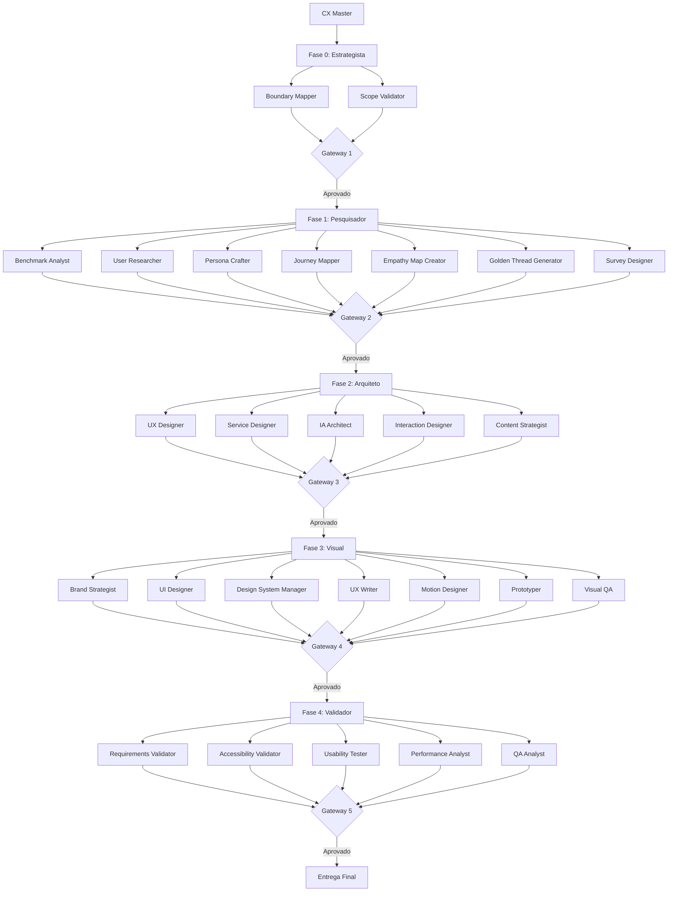

# 🏗️ Arquitetura Completa dos Agentes - CX Operating System

## 🎯 Visão Geral

Sistema multiagentes com **1 CX Master + 5 Macro Agentes + 23 Subagentes Especializados**, totalizando **29 agentes** trabalhando em conjunto para entregar experiências excepcionais.

## 📊 Hierarquia Completa

```
👑 CX MASTER (Nível 1 - Orquestração)
│
├── 📌 FASE 0: ESTRATEGISTA (Nível 2 - Coordenação)
│   ├── Boundary Mapper (Nível 3)
│   └── Scope Validator (Nível 3)
│
├── 🔎 FASE 1: PESQUISADOR (Nível 2 - Coordenação)
│   ├── Benchmark Analyst (Nível 3)
│   ├── User Researcher (Nível 3)
│   ├── Persona Crafter (Nível 3)
│   ├── Journey Mapper (Nível 3)
│   ├── Empathy Map Creator (Nível 3) ⭐ NOVO
│   ├── Golden Thread Generator (Nível 3) ⭐ NOVO
│   └── Survey Designer (Nível 3) ⭐ NOVO
│
├── 🏗️ FASE 2: ARQUITETO (Nível 2 - Coordenação)
│   ├── UX Designer (Nível 3)
│   ├── Service Designer (Nível 3)
│   ├── IA Architect (Nível 3)
│   ├── Interaction Designer (Nível 3) ⭐ NOVO
│   └── Content Strategist (Nível 3) ⭐ NOVO
│
├── 🎨 FASE 3: VISUAL (Nível 2 - Coordenação)
│   ├── Brand Strategist (Nível 3) ⭐ NOVO
│   ├── UI Designer (Nível 3)
│   ├── Design System Manager (Nível 3)
│   ├── UX Writer (Nível 3) ⭐ NOVO
│   ├── Motion Designer (Nível 3) ⭐ NOVO
│   ├── Prototyper (Nível 3)
│   └── Visual QA (Nível 3) ⭐ NOVO
│
└── 🛡️ FASE 4: VALIDADOR (Nível 2 - Coordenação)
    ├── Requirements Validator (Nível 3)
    ├── Accessibility Validator (Nível 3)
    ├── Usability Tester (Nível 3) ⭐ NOVO
    ├── Performance Analyst (Nível 3) ⭐ NOVO
    └── QA Analyst (Nível 3)
```

## 📌 FASE 0: ESTRATEGISTA (2 Subagentes)

### Objetivo
Mapear fronteiras, validar viabilidade e estabelecer contrato de escopo.

### Subagentes

#### 1. Boundary Mapper
**Função:** Mapear todas as restrições e fronteiras do projeto

**Responsabilidades:**
- Identificar restrições técnicas (stack, APIs, performance)
- Mapear restrições de negócio (budget, timeline, recursos)
- Documentar restrições de design (acessibilidade, branding)
- Listar dependências externas
- Definir integrações necessárias

**Output:** Documento de Restrições completo

#### 2. Scope Validator
**Função:** Validar viabilidade e calcular maturidade

**Responsabilidades:**
- Avaliar viabilidade técnica
- Calcular matriz de maturidade (Design, Técnica, UX)
- Identificar riscos críticos
- Estimar complexidade
- Recomendar abordagem

**Output:** Matriz de Maturidade + Análise de Viabilidade

---

## 🔎 FASE 1: PESQUISADOR (7 Subagentes) ⭐ EXPANDIDO

### Objetivo
Minerar dados e emoções para identificar dores reais e criar personas validadas.

### Subagentes

#### 1. Benchmark Analyst
**Função:** Análise competitiva profunda

**Responsabilidades:**
- Analisar concorrentes diretos e indiretos
- Identificar melhores práticas do mercado
- Mapear diferenciais competitivos
- Avaliar tendências de mercado
- Gerar insights estratégicos

**Output:** Relatório de Benchmark Competitivo

#### 2. User Researcher
**Função:** Pesquisa com usuários reais

**Responsabilidades:**
- Planejar e executar entrevistas
- Conduzir observações contextuais
- Analisar dados qualitativos
- Identificar padrões de comportamento
- Extrair insights de usuários

**Output:** Relatório de Pesquisa de Usuários

#### 3. Persona Crafter
**Função:** Criar personas acionáveis baseadas em dados

**Responsabilidades:**
- Sintetizar dados de pesquisa
- Criar arquétipos de usuários
- Definir objetivos e motivações
- Mapear frustrações e necessidades
- Validar personas com stakeholders

**Output:** Personas Validadas (3-5 personas)

#### 4. Journey Mapper
**Função:** Mapear jornadas As-Is (estado atual)

**Responsabilidades:**
- Mapear touchpoints atuais
- Identificar pain points
- Mapear emoções em cada etapa
- Documentar contexto de uso
- Priorizar fricções

**Output:** Jornadas As-Is + Matriz de Fricções

#### 5. Empathy Map Creator ⭐ NOVO
**Função:** Criar mapas de empatia profundos

**Responsabilidades:**
- Mapear o que o usuário **vê** (ambiente, contexto)
- Mapear o que o usuário **ouve** (influências, opiniões)
- Mapear o que o usuário **pensa e sente** (preocupações, aspirações)
- Mapear o que o usuário **fala e faz** (comportamentos, ações)
- Identificar **dores** (frustrações, obstáculos)
- Identificar **ganhos** (desejos, necessidades)

**Output:** Mapas de Empatia por Persona

**Formato:**
```markdown
# Mapa de Empatia - [Persona]

## O que VÊ?
- Ambiente físico/digital
- Ofertas no mercado
- Problemas ao redor

## O que OUVE?
- O que amigos dizem
- O que influenciadores dizem
- O que a mídia diz

## O que PENSA e SENTE?
- Preocupações principais
- Aspirações
- Medos

## O que FALA e FAZ?
- Comportamentos públicos
- Atitudes
- Ações observáveis

## DORES
- Frustrações
- Obstáculos
- Riscos

## GANHOS
- Desejos
- Necessidades
- Medidas de sucesso
```

#### 6. Golden Thread Generator ⭐ NOVO
**Função:** Gerar conexões entre dor, solução e benefícios (Fio de Ouro)

**Responsabilidades:**
- Identificar dores principais do usuário
- Conectar dores com soluções propostas
- Articular benefícios tangíveis
- Criar narrativa coesa (dor → solução → benefício)
- Validar proposta de valor

**Output:** Documento de Fio de Ouro (Golden Thread)

**Formato:**
```markdown
# Fio de Ouro - [Projeto]

## Dor do Usuário
[Descrição da dor principal identificada]

**Evidências:**
- Dado 1 da pesquisa
- Dado 2 das entrevistas
- Dado 3 do benchmark

## Solução Proposta
[Como o projeto resolve essa dor]

**Funcionalidades-chave:**
- Feature 1
- Feature 2
- Feature 3

## Benefícios Tangíveis
[O que o usuário ganha]

**Benefícios Mensuráveis:**
- Reduz tempo em X%
- Aumenta satisfação em Y%
- Economiza Z reais/mês

## Proposta de Valor
[Síntese: Por que o usuário deve usar?]

## Diferencial Competitivo
[O que nos torna únicos?]
```

#### 7. Survey Designer ⭐ NOVO
**Função:** Criar questionários quantitativos e qualitativos

**Responsabilidades:**
- Desenhar questionários quantitativos (métricas, escalas)
- Desenhar questionários qualitativos (perguntas abertas)
- Definir amostra e critérios de seleção
- Criar roteiros de entrevista
- Validar instrumentos de pesquisa

**Output:** Questionários Quantitativos e Qualitativos

**Tipos de Questionários:**

**Quantitativo:**
- Perguntas fechadas (múltipla escolha, escala Likert)
- Métricas (NPS, CSAT, CES)
- Dados demográficos
- Comportamentos mensuráveis

**Qualitativo:**
- Perguntas abertas
- Roteiros de entrevista
- Grupos focais
- Testes de usabilidade

**Formato:**
```markdown
# Questionário Quantitativo - [Projeto]

## Objetivos
- Objetivo 1
- Objetivo 2

## Perfil do Respondente
- Critério 1
- Critério 2

## Perguntas

### Seção 1: Perfil
1. Qual sua idade? [18-25] [26-35] [36-45] [46+]
2. Com que frequência usa apps de [categoria]?

### Seção 2: Comportamento
3. Qual sua principal dor ao usar [produto]?
4. Em uma escala de 1-10, quão satisfeito você está?

### Seção 3: NPS
5. Qual a probabilidade de recomendar? [0-10]

---

# Roteiro Qualitativo - [Projeto]

## Objetivos da Entrevista
- Entender contexto de uso
- Identificar dores profundas

## Perguntas de Aquecimento
1. Conte-me sobre sua rotina...
2. Como você resolve [problema] hoje?

## Perguntas Principais
3. Qual sua maior frustração com...?
4. Se pudesse mudar uma coisa, o que seria?

## Perguntas de Fechamento
5. Algo mais que gostaria de compartilhar?
```

---

## 🏗️ FASE 2: ARQUITETO (5 Subagentes) ⭐ EXPANDIDO

### Objetivo
Desenhar o esqueleto da experiência, otimizar o serviço e estruturar conteúdo.

### Subagentes

#### 1. UX Designer
**Função:** Estruturar fluxos e modelos mentais

**Responsabilidades:**
- Criar wireframes lógicos
- Desenhar fluxos de usuário
- Definir modelos mentais
- Estruturar navegação
- Validar usabilidade

**Output:** Wireframes + Fluxos de Usuário

#### 2. Service Designer
**Função:** Mapear processos end-to-end e otimizar serviço

**Responsabilidades:**
- Analisar jornadas As-Is (da Fase 1)
- Identificar gaps e oportunidades
- Criar jornada To-Be otimizada
- Desenhar service blueprint completo
- Mapear todos os touchpoints
- Definir processos backstage

**Output:** Service Blueprint + Jornada To-Be + Análise de Gaps

#### 3. IA Architect (Information Architecture)
**Função:** Definir arquitetura de informação

**Responsabilidades:**
- Criar sitemap
- Definir taxonomia
- Estruturar hierarquia de conteúdo
- Organizar navegação
- Validar findability

**Output:** Sitemap + Taxonomia + Estrutura de Navegação

#### 4. Interaction Designer ⭐ NOVO
**Função:** Desenhar interações e microinterações

**Responsabilidades:**
- Definir padrões de interação
- Desenhar microinterações
- Especificar estados (hover, active, disabled)
- Definir feedback visual
- Criar protótipos de interação

**Output:** Especificações de Interação + Protótipos

**Exemplos:**
- Como botões respondem ao clique
- Animações de transição entre telas
- Feedback de loading
- Gestos em mobile
- Atalhos de teclado

#### 5. Content Strategist ⭐ NOVO
**Função:** Estratégia de conteúdo e arquitetura de mensagens

**Responsabilidades:**
- Definir estratégia de conteúdo
- Criar arquitetura de mensagens
- Planejar hierarquia de informação
- Definir tom e voz (preliminar)
- Estruturar conteúdo por contexto

**Output:** Estratégia de Conteúdo + Arquitetura de Mensagens

**Entregáveis:**
```markdown
# Estratégia de Conteúdo

## Princípios de Conteúdo
1. Clareza acima de tudo
2. Concisão sem perder contexto
3. Consistência em toda jornada

## Hierarquia de Informação
- Primária: [O que é mais importante]
- Secundária: [Informações de suporte]
- Terciária: [Detalhes adicionais]

## Conteúdo por Contexto
- Onboarding: [Mensagens de boas-vindas]
- Uso diário: [Mensagens funcionais]
- Erro: [Mensagens de erro claras]
- Sucesso: [Mensagens de confirmação]
```

---

## 🎨 FASE 3: VISUAL (7 Subagentes) ⭐ EXPANDIDO

### Objetivo
Materializar com alta fidelidade, aplicar branding e criar conteúdo.

### Subagentes

#### 1. Brand Strategist ⭐ NOVO
**Função:** Entender e aplicar posicionamento de marca

**Responsabilidades:**
- Analisar posicionamento da marca
- Mapear valores e personalidade
- Documentar assets de marca (logos, cores, tipografia)
- Definir aplicação de marca no projeto
- Garantir consistência de branding

**Output:** Guia de Aplicação de Marca + Brand Assets

**Entregáveis:**
```markdown
# Posicionamento de Marca - [Projeto]

## Essência da Marca
- **Missão:** [Por que existimos]
- **Visão:** [Onde queremos chegar]
- **Valores:** [No que acreditamos]

## Personalidade da Marca
- **Arquétipo:** [Ex: Herói, Sábio, Explorador]
- **Atributos:** [Inovador, Confiável, Acessível]
- **Tom:** [Profissional, Amigável, Inspirador]

## Assets de Marca
- **Logo:** [Variações, uso correto]
- **Cores:** [Paleta primária e secundária]
- **Tipografia:** [Fontes principais]
- **Iconografia:** [Estilo de ícones]
- **Fotografia:** [Estilo visual]

## Aplicação no Projeto
- Como aplicar marca em [contexto 1]
- Como aplicar marca em [contexto 2]
- Casos especiais e exceções
```

#### 2. UI Designer
**Função:** Criar interfaces de alta fidelidade

**Responsabilidades:**
- Aplicar design system
- Criar mockups de alta fidelidade
- Aplicar branding consistentemente
- Garantir responsividade
- Criar variações de telas

**Output:** Mockups de Alta Fidelidade

#### 3. Design System Manager
**Função:** Gerenciar tokens e componentes

**Responsabilidades:**
- Criar/atualizar design system
- Extrair design tokens
- Documentar componentes
- Definir variações e estados
- Manter consistência

**Output:** Design System + Tokens + Documentação

#### 4. UX Writer ⭐ NOVO
**Função:** Criar microcopy e conteúdo da interface

**Responsabilidades:**
- Entender posicionamento e tom de voz da marca
- Escrever microcopy (botões, labels, mensagens)
- Criar mensagens de erro e sucesso
- Escrever tooltips e hints
- Garantir clareza e consistência
- Adaptar conteúdo para diferentes contextos

**Output:** Guia de UX Writing + Microcopy Completo

**Entregáveis:**
```markdown
# Guia de UX Writing - [Projeto]

## Tom de Voz
- **Personalidade:** [Amigável, Profissional, Inspirador]
- **Formalidade:** [Informal, Neutro, Formal]
- **Emoção:** [Entusiasta, Calmo, Motivador]

## Princípios de Escrita
1. **Clareza:** Use linguagem simples
2. **Concisão:** Seja direto ao ponto
3. **Consistência:** Mantenha padrões
4. **Empatia:** Entenda o contexto do usuário

## Microcopy por Contexto

### Botões
- Primário: "Começar agora"
- Secundário: "Saiba mais"
- Cancelar: "Voltar"

### Mensagens de Erro
- Erro de validação: "Ops! Verifique o campo [X]"
- Erro de sistema: "Algo deu errado. Tente novamente"
- Erro de rede: "Sem conexão. Verifique sua internet"

### Mensagens de Sucesso
- Ação concluída: "Pronto! [Ação] realizada com sucesso"
- Confirmação: "Tudo certo! Você receberá um email"

### Empty States
- Sem dados: "Nada por aqui ainda. [Ação sugerida]"
- Sem resultados: "Não encontramos nada. Tente outra busca"

### Tooltips
- Ajuda contextual: "Dica: [Informação útil]"
- Informação adicional: "[Explicação breve]"

## Glossário
- Termo 1: Como usar
- Termo 2: Como usar
```

#### 5. Motion Designer ⭐ NOVO
**Função:** Criar animações e transições

**Responsabilidades:**
- Definir princípios de motion
- Criar animações de transição
- Desenhar microanimações
- Especificar timing e easing
- Garantir performance

**Output:** Especificações de Motion + Protótipos Animados

**Entregáveis:**
```markdown
# Motion Design - [Projeto]

## Princípios de Motion
1. **Propósito:** Toda animação tem um objetivo
2. **Performance:** Animações leves (60fps)
3. **Naturalidade:** Movimentos orgânicos
4. **Consistência:** Padrões reutilizáveis

## Timing e Easing
- **Rápido:** 150ms (microinterações)
- **Médio:** 300ms (transições)
- **Lento:** 500ms (animações complexas)
- **Easing:** ease-out (padrão)

## Animações por Contexto

### Transições de Tela
- Fade in/out: 300ms ease-out
- Slide: 350ms ease-in-out
- Scale: 250ms ease-out

### Microinterações
- Hover: 150ms ease-out
- Click: 100ms ease-in
- Loading: loop infinito

### Feedback
- Sucesso: bounce 400ms
- Erro: shake 300ms
- Loading: pulse 1s loop
```

#### 6. Prototyper
**Função:** Criar protótipos interativos

**Responsabilidades:**
- Criar protótipos de alta fidelidade
- Adicionar interações
- Simular fluxos completos
- Preparar para testes
- Documentar comportamentos

**Output:** Protótipos Interativos

#### 7. Visual QA ⭐ NOVO
**Função:** Garantir qualidade visual antes da validação final

**Responsabilidades:**
- Verificar consistência visual
- Validar aplicação do design system
- Checar responsividade
- Verificar acessibilidade visual (contraste)
- Identificar inconsistências

**Output:** Relatório de Visual QA

---

## 🛡️ FASE 4: VALIDADOR (5 Subagentes) ⭐ EXPANDIDO

### Objetivo
Garantir compliance, acessibilidade, usabilidade e qualidade.

### Subagentes

#### 1. Requirements Validator
**Função:** Garantir cobertura completa de requisitos

**Responsabilidades:**
- Validar requisitos funcionais
- Validar requisitos não-funcionais
- Verificar cobertura de casos de uso
- Identificar gaps
- Gerar matriz de rastreabilidade

**Output:** Matriz de Requisitos + Relatório de Cobertura

#### 2. Accessibility Validator
**Função:** Conformidade WCAG 2.1 AA

**Responsabilidades:**
- Validar contraste de cores
- Verificar navegação por teclado
- Testar leitores de tela
- Validar textos alternativos
- Gerar checklist WCAG

**Output:** Relatório de Acessibilidade + Checklist WCAG

#### 3. Usability Tester ⭐ NOVO
**Função:** Testar usabilidade com usuários reais

**Responsabilidades:**
- Planejar testes de usabilidade
- Recrutar participantes
- Conduzir testes (moderados/não-moderados)
- Analisar resultados
- Identificar problemas de usabilidade
- Calcular métricas (taxa de sucesso, tempo, erros)

**Output:** Relatório de Testes de Usabilidade + Métricas

**Métricas:**
- Taxa de sucesso por tarefa
- Tempo médio por tarefa
- Número de erros
- Satisfação (SUS - System Usability Scale)
- Recomendações de melhoria

#### 4. Performance Analyst ⭐ NOVO
**Função:** Analisar performance e otimização

**Responsabilidades:**
- Avaliar tempo de carregamento
- Analisar tamanho de assets
- Verificar otimização de imagens
- Testar performance em diferentes dispositivos
- Recomendar otimizações

**Output:** Relatório de Performance + Recomendações

**Métricas:**
- First Contentful Paint (FCP)
- Largest Contentful Paint (LCP)
- Time to Interactive (TTI)
- Cumulative Layout Shift (CLS)
- Tamanho total de assets

#### 5. QA Analyst
**Função:** Avaliação geral de qualidade e implementabilidade

**Responsabilidades:**
- Avaliar implementabilidade técnica
- Verificar documentação completa
- Validar handoff para desenvolvimento
- Identificar riscos de implementação
- Gerar relatório final

**Output:** Relatório Final de QA + Handoff Técnico

---

## 📊 Resumo da Arquitetura

### Total de Agentes: 29

| Nível | Tipo | Quantidade |
|-------|------|------------|
| Nível 1 | CX Master | 1 |
| Nível 2 | Macro Agentes | 5 |
| Nível 3 | Subagentes | 23 |

### Distribuição por Fase

| Fase | Macro Agente | Subagentes | Total |
|------|--------------|------------|-------|
| Fase 0 | Estrategista | 2 | 3 |
| Fase 1 | Pesquisador | 7 ⭐ | 8 |
| Fase 2 | Arquiteto | 5 ⭐ | 6 |
| Fase 3 | Visual | 7 ⭐ | 8 |
| Fase 4 | Validador | 5 ⭐ | 6 |

### Novos Subagentes Adicionados: 10

**Fase 1 (3 novos):**
- Empathy Map Creator
- Golden Thread Generator
- Survey Designer

**Fase 2 (2 novos):**
- Interaction Designer
- Content Strategist

**Fase 3 (4 novos):**
- Brand Strategist
- UX Writer
- Motion Designer
- Visual QA

**Fase 4 (2 novos):**
- Usability Tester
- Performance Analyst

---

## 🔄 Workflow Completo



---

## 🎯 Próximos Passos

1. ✅ Arquitetura completa definida (29 agentes)
2. ⏳ Criar metaprompts para novos subagentes
3. ⏳ Atualizar templates com novos entregáveis
4. ⏳ Documentar workflows detalhados
5. ⏳ Criar exemplos de uso

---

**Versão:** 2.0.0  
**Data:** 2026-04-23  
**Status:** ✅ Arquitetura Expandida  
**Total de Agentes:** 29 (1 Master + 5 Macro + 23 Sub)