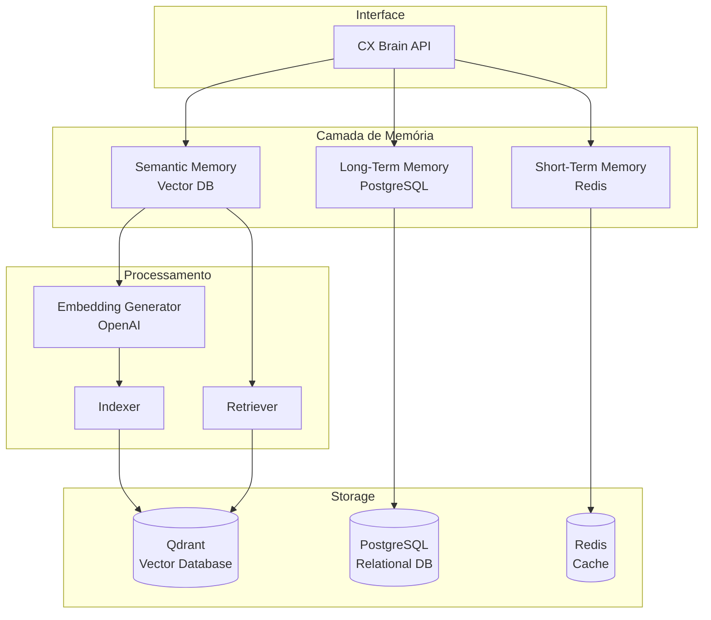

# 🧠 CX Brain - Especificações Técnicas

## 📋 Visão Geral

O **CX Brain** é o sistema de memória global contínua que garante que nenhum agente perde contexto. Armazena restrições técnicas, decisões de branding e regras de negócio em um vetor central acessível por todos os agentes.

## 🎯 Objetivos

### Primários
1. **Persistência de Contexto:** Manter contexto completo do projeto através de todas as fases
2. **Busca Semântica:** Recuperar informações relevantes baseado em similaridade
3. **Aprendizado Contínuo:** Evoluir com base em projetos anteriores
4. **Rastreabilidade:** Auditar todas as decisões e mudanças de contexto

### Secundários
1. **Performance:** Busca < 100ms para 95% das queries
2. **Escalabilidade:** Suportar 1000+ projetos simultâneos
3. **Confiabilidade:** 99.9% de disponibilidade
4. **Segurança:** Isolamento de dados por projeto/cliente

## 🏗️ Arquitetura

### Componentes Principais



## 💾 Tipos de Memória

### 1. Memória de Curto Prazo (Short-Term Memory)

**Propósito:** Armazenar contexto da sessão atual

**Tecnologia:** Redis (in-memory cache)

**Estrutura de Dados:**

```python
class ShortTermMemory:
    """
    Memória de curto prazo - Sessão atual
    TTL: 24 horas
    """
    
    def __init__(self, redis_client):
        self.redis = redis_client
        self.ttl = 86400  # 24 horas
    
    def store(self, session_id: str, key: str, value: dict):
        """Armazena dado na sessão"""
        cache_key = f"stm:{session_id}:{key}"
        self.redis.setex(
            cache_key,
            self.ttl,
            json.dumps(value)
        )
    
    def retrieve(self, session_id: str, key: str) -> dict:
        """Recupera dado da sessão"""
        cache_key = f"stm:{session_id}:{key}"
        data = self.redis.get(cache_key)
        return json.loads(data) if data else None
    
    def get_session_context(self, session_id: str) -> dict:
        """Recupera todo contexto da sessão"""
        pattern = f"stm:{session_id}:*"
        keys = self.redis.keys(pattern)
        
        context = {}
        for key in keys:
            field = key.decode().split(":")[-1]
            context[field] = json.loads(self.redis.get(key))
        
        return context
    
    def extend_ttl(self, session_id: str):
        """Estende TTL de toda a sessão"""
        pattern = f"stm:{session_id}:*"
        keys = self.redis.keys(pattern)
        
        for key in keys:
            self.redis.expire(key, self.ttl)
```

**Dados Armazenados:**
- Interações recentes (últimas 50)
- Contexto ativo do projeto
- Decisões temporárias
- Estado atual de execução
- Cache de queries frequentes

**Exemplo de Uso:**

```python
stm = ShortTermMemory(redis_client)

# Armazenar interação
stm.store(
    session_id="proj_123_session_456",
    key="last_interaction",
    value={
        "timestamp": "2026-04-16T18:00:00Z",
        "agent": "pesquisador",
        "action": "create_persona",
        "result": "success"
    }
)

# Recuperar contexto completo
context = stm.get_session_context("proj_123_session_456")
```

### 2. Memória de Longo Prazo (Long-Term Memory)

**Propósito:** Armazenar histórico de projetos e aprendizados

**Tecnologia:** PostgreSQL (relational database)

**Schema:**

```sql
-- Tabela de Projetos
CREATE TABLE projects (
    id UUID PRIMARY KEY,
    nome VARCHAR(255) NOT NULL,
    cliente VARCHAR(255),
    tipo VARCHAR(50),
    status VARCHAR(50),
    data_inicio TIMESTAMP,
    data_conclusao TIMESTAMP,
    metadata JSONB,
    created_at TIMESTAMP DEFAULT NOW(),
    updated_at TIMESTAMP DEFAULT NOW()
);

-- Tabela de Fases
CREATE TABLE project_phases (
    id UUID PRIMARY KEY,
    project_id UUID REFERENCES projects(id),
    fase_numero INTEGER,
    fase_nome VARCHAR(100),
    agente_executor VARCHAR(100),
    quality_score INTEGER,
    tempo_execucao INTERVAL,
    iteracoes INTEGER,
    status VARCHAR(50),
    output_path TEXT,
    metadata JSONB,
    created_at TIMESTAMP DEFAULT NOW()
);

-- Tabela de Decisões
CREATE TABLE decisions (
    id UUID PRIMARY KEY,
    project_id UUID REFERENCES projects(id),
    fase_id UUID REFERENCES project_phases(id),
    decisao TEXT NOT NULL,
    justificativa TEXT,
    impacto TEXT,
    tomada_por VARCHAR(100),
    tomada_em TIMESTAMP,
    metadata JSONB,
    created_at TIMESTAMP DEFAULT NOW()
);

-- Tabela de Padrões Aprendidos
CREATE TABLE learned_patterns (
    id UUID PRIMARY KEY,
    tipo VARCHAR(100),
    padrao TEXT,
    contexto JSONB,
    frequencia INTEGER DEFAULT 1,
    sucesso_rate FLOAT,
    projetos_relacionados UUID[],
    tags TEXT[],
    created_at TIMESTAMP DEFAULT NOW(),
    updated_at TIMESTAMP DEFAULT NOW()
);

-- Tabela de Restrições
CREATE TABLE constraints (
    id UUID PRIMARY KEY,
    project_id UUID REFERENCES projects(id),
    tipo VARCHAR(50), -- tecnica, negocio, design
    descricao TEXT,
    severidade VARCHAR(20),
    ativa BOOLEAN DEFAULT TRUE,
    metadata JSONB,
    created_at TIMESTAMP DEFAULT NOW()
);

-- Índices para performance
CREATE INDEX idx_projects_status ON projects(status);
CREATE INDEX idx_projects_cliente ON projects(cliente);
CREATE INDEX idx_phases_project ON project_phases(project_id);
CREATE INDEX idx_decisions_project ON decisions(project_id);
CREATE INDEX idx_patterns_tipo ON learned_patterns(tipo);
CREATE INDEX idx_constraints_project ON constraints(project_id);
```

**Implementação:**

```python
class LongTermMemory:
    """
    Memória de longo prazo - Histórico de projetos
    Persistência: Permanente
    """
    
    def __init__(self, db_connection):
        self.db = db_connection
    
    def store_project(self, project: dict) -> str:
        """Armazena novo projeto"""
        query = """
            INSERT INTO projects (id, nome, cliente, tipo, status, data_inicio, metadata)
            VALUES (%s, %s, %s, %s, %s, %s, %s)
            RETURNING id
        """
        project_id = str(uuid.uuid4())
        
        self.db.execute(query, (
            project_id,
            project["nome"],
            project["cliente"],
            project["tipo"],
            "iniciado",
            datetime.now(),
            json.dumps(project.get("metadata", {}))
        ))
        
        return project_id
    
    def store_phase_result(self, phase: dict):
        """Armazena resultado de uma fase"""
        query = """
            INSERT INTO project_phases 
            (id, project_id, fase_numero, fase_nome, agente_executor, 
             quality_score, tempo_execucao, iteracoes, status, output_path, metadata)
            VALUES (%s, %s, %s, %s, %s, %s, %s, %s, %s, %s, %s)
        """
        
        self.db.execute(query, (
            str(uuid.uuid4()),
            phase["project_id"],
            phase["fase_numero"],
            phase["fase_nome"],
            phase["agente_executor"],
            phase["quality_score"],
            phase["tempo_execucao"],
            phase["iteracoes"],
            phase["status"],
            phase["output_path"],
            json.dumps(phase.get("metadata", {}))
        ))
    
    def store_decision(self, decision: dict):
        """Armazena decisão tomada"""
        query = """
            INSERT INTO decisions 
            (id, project_id, fase_id, decisao, justificativa, impacto, tomada_por, tomada_em)
            VALUES (%s, %s, %s, %s, %s, %s, %s, %s)
        """
        
        self.db.execute(query, (
            str(uuid.uuid4()),
            decision["project_id"],
            decision.get("fase_id"),
            decision["decisao"],
            decision["justificativa"],
            decision["impacto"],
            decision["tomada_por"],
            datetime.now()
        ))
    
    def learn_pattern(self, pattern: dict):
        """Aprende novo padrão ou atualiza existente"""
        # Verifica se padrão já existe
        existing = self.db.execute("""
            SELECT id, frequencia FROM learned_patterns
            WHERE tipo = %s AND padrao = %s
        """, (pattern["tipo"], pattern["padrao"]))
        
        if existing:
            # Atualiza frequência
            self.db.execute("""
                UPDATE learned_patterns
                SET frequencia = frequencia + 1,
                    updated_at = NOW()
                WHERE id = %s
            """, (existing[0]["id"],))
        else:
            # Cria novo padrão
            self.db.execute("""
                INSERT INTO learned_patterns
                (id, tipo, padrao, contexto, tags)
                VALUES (%s, %s, %s, %s, %s)
            """, (
                str(uuid.uuid4()),
                pattern["tipo"],
                pattern["padrao"],
                json.dumps(pattern["contexto"]),
                pattern.get("tags", [])
            ))
    
    def get_project_history(self, project_id: str) -> dict:
        """Recupera histórico completo do projeto"""
        project = self.db.execute("""
            SELECT * FROM projects WHERE id = %s
        """, (project_id,))[0]
        
        phases = self.db.execute("""
            SELECT * FROM project_phases 
            WHERE project_id = %s 
            ORDER BY fase_numero
        """, (project_id,))
        
        decisions = self.db.execute("""
            SELECT * FROM decisions 
            WHERE project_id = %s 
            ORDER BY tomada_em
        """, (project_id,))
        
        constraints = self.db.execute("""
            SELECT * FROM constraints 
            WHERE project_id = %s AND ativa = TRUE
        """, (project_id,))
        
        return {
            "project": project,
            "phases": phases,
            "decisions": decisions,
            "constraints": constraints
        }
    
    def get_similar_projects(self, tipo: str, limit: int = 5) -> list:
        """Busca projetos similares"""
        return self.db.execute("""
            SELECT * FROM projects
            WHERE tipo = %s AND status = 'concluido'
            ORDER BY data_conclusao DESC
            LIMIT %s
        """, (tipo, limit))
```

### 3. Memória Semântica (Semantic Memory)

**Propósito:** Busca semântica de contexto relevante

**Tecnologia:** Qdrant (vector database)

**Estrutura:**

```python
from qdrant_client import QdrantClient
from qdrant_client.models import Distance, VectorParams, PointStruct
import openai

class SemanticMemory:
    """
    Memória semântica - Busca por similaridade
    Persistência: Permanente
    """
    
    def __init__(self, qdrant_url: str, openai_key: str):
        self.qdrant = QdrantClient(url=qdrant_url)
        self.openai_key = openai_key
        self.collection_name = "cx_memory"
        self.vector_size = 1536  # OpenAI ada-002
        
        # Cria collection se não existir
        self._ensure_collection()
    
    def _ensure_collection(self):
        """Garante que a collection existe"""
        try:
            self.qdrant.get_collection(self.collection_name)
        except:
            self.qdrant.create_collection(
                collection_name=self.collection_name,
                vectors_config=VectorParams(
                    size=self.vector_size,
                    distance=Distance.COSINE
                )
            )
    
    def _create_embedding(self, text: str) -> list[float]:
        """Cria embedding usando OpenAI"""
        response = openai.Embedding.create(
            model="text-embedding-ada-002",
            input=text
        )
        return response['data'][0]['embedding']
    
    def store(self, id: str, text: str, metadata: dict):
        """Armazena texto com embedding"""
        embedding = self._create_embedding(text)
        
        point = PointStruct(
            id=id,
            vector=embedding,
            payload={
                "text": text,
                "metadata": metadata,
                "timestamp": datetime.now().isoformat()
            }
        )
        
        self.qdrant.upsert(
            collection_name=self.collection_name,
            points=[point]
        )
    
    def search(self, query: str, limit: int = 5, filter: dict = None) -> list:
        """Busca por similaridade semântica"""
        query_embedding = self._create_embedding(query)
        
        results = self.qdrant.search(
            collection_name=self.collection_name,
            query_vector=query_embedding,
            limit=limit,
            query_filter=filter
        )
        
        return [
            {
                "id": hit.id,
                "score": hit.score,
                "text": hit.payload["text"],
                "metadata": hit.payload["metadata"]
            }
            for hit in results
        ]
    
    def store_interaction(self, interaction: dict):
        """Armazena interação com contexto"""
        text = f"""
        Fase: {interaction['fase']}
        Agente: {interaction['agente']}
        Ação: {interaction['acao']}
        Contexto: {interaction['contexto']}
        Resultado: {interaction['resultado']}
        """
        
        self.store(
            id=str(uuid.uuid4()),
            text=text,
            metadata={
                "tipo": "interaction",
                "project_id": interaction["project_id"],
                "fase": interaction["fase"],
                "agente": interaction["agente"]
            }
        )
    
    def store_decision(self, decision: dict):
        """Armazena decisão com contexto"""
        text = f"""
        Decisão: {decision['decisao']}
        Justificativa: {decision['justificativa']}
        Impacto: {decision['impacto']}
        Contexto: {decision['contexto']}
        """
        
        self.store(
            id=str(uuid.uuid4()),
            text=text,
            metadata={
                "tipo": "decision",
                "project_id": decision["project_id"],
                "fase": decision.get("fase")
            }
        )
    
    def retrieve_relevant_context(self, query: str, project_id: str = None) -> list:
        """Recupera contexto relevante para uma query"""
        filter_dict = None
        if project_id:
            filter_dict = {
                "must": [
                    {"key": "metadata.project_id", "match": {"value": project_id}}
                ]
            }
        
        return self.search(query, limit=10, filter=filter_dict)
```

## 🔄 Sistema Integrado

### CX Brain Principal

```python
class CXBrain:
    """
    Sistema de memória integrado
    Combina STM, LTM e SM
    """
    
    def __init__(self, redis_client, db_connection, qdrant_url, openai_key):
        self.stm = ShortTermMemory(redis_client)
        self.ltm = LongTermMemory(db_connection)
        self.sm = SemanticMemory(qdrant_url, openai_key)
    
    def store_interaction(self, session_id: str, interaction: dict):
        """Armazena interação em todas as camadas"""
        # Curto prazo (cache)
        self.stm.store(session_id, "last_interaction", interaction)
        
        # Longo prazo (histórico)
        if self._is_significant(interaction):
            self.ltm.store_decision({
                "project_id": interaction["project_id"],
                "decisao": interaction["acao"],
                "justificativa": interaction.get("justificativa", ""),
                "impacto": interaction.get("impacto", ""),
                "tomada_por": interaction["agente"]
            })
        
        # Semântica (busca)
        self.sm.store_interaction(interaction)
    
    def retrieve_context(self, session_id: str, query: str) -> dict:
        """Recupera contexto completo relevante"""
        # Contexto da sessão atual
        current_context = self.stm.get_session_context(session_id)
        
        # Busca semântica
        project_id = current_context.get("project", {}).get("id")
        relevant = self.sm.retrieve_relevant_context(query, project_id)
        
        # Histórico do projeto
        history = None
        if project_id:
            history = self.ltm.get_project_history(project_id)
        
        return {
            "current": current_context,
            "relevant": relevant,
            "history": history
        }
    
    def _is_significant(self, interaction: dict) -> bool:
        """Determina se interação é significativa para LTM"""
        significant_actions = [
            "create_persona",
            "define_architecture",
            "approve_design",
            "validate_accessibility"
        ]
        return interaction.get("acao") in significant_actions
```

## 📊 Métricas e Monitoramento

### KPIs do CX Brain

```python
class BrainMetrics:
    """Métricas do sistema de memória"""
    
    def __init__(self, brain: CXBrain):
        self.brain = brain
    
    def get_metrics(self) -> dict:
        return {
            "stm": {
                "active_sessions": self._count_active_sessions(),
                "cache_hit_rate": self._calculate_cache_hit_rate(),
                "avg_session_size": self._avg_session_size()
            },
            "ltm": {
                "total_projects": self._count_projects(),
                "total_decisions": self._count_decisions(),
                "patterns_learned": self._count_patterns()
            },
            "sm": {
                "total_vectors": self._count_vectors(),
                "avg_search_time": self._avg_search_time(),
                "index_size": self._get_index_size()
            }
        }
```

---

**Documento Criado:** 2026-04-16  
**Versão:** 1.0.0  
**Status:** Especificações Completas