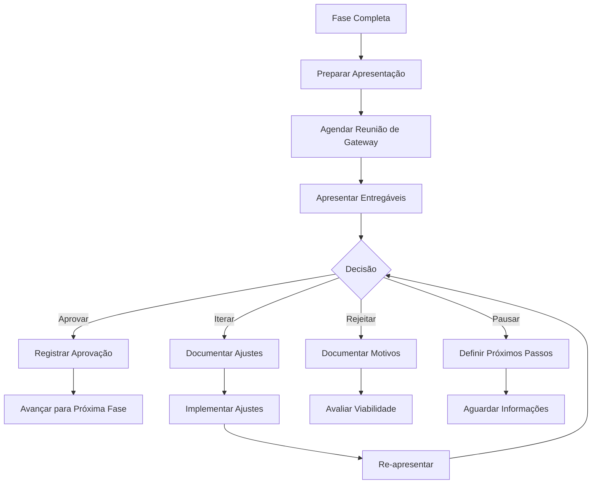

# 🛑 Sistema de Gateways de Aprovação Humana

## 🎯 Visão Geral

O Sistema de Gateways é um dos **3 pilares inegociáveis** do CX Operating System. Ele garante que a automação não seja cega, implementando pontos de controle humano obrigatórios entre cada fase do processo.

### Princípios Fundamentais

1. **Human-in-the-Loop:** Humanos tomam decisões críticas
2. **Bloqueio Obrigatório:** Sistema não avança sem aprovação
3. **Rastreabilidade:** Todas as decisões são registradas
4. **Feedback Loop:** Stakeholders podem solicitar iterações

## 🏗️ Arquitetura do Sistema

### 5 Gateways Estratégicos

```
BRIEFING
   ↓
FASE 0: ESTRATEGISTA
   ↓
[🛑 GATEWAY 1] ← Aprovação de Escopo
   ↓
FASE 1: PESQUISADOR
   ↓
[🛑 GATEWAY 2] ← Aprovação de Insights
   ↓
FASE 2: ARQUITETO
   ↓
[🛑 GATEWAY 3] ← Aprovação de Arquitetura
   ↓
FASE 3: VISUAL
   ↓
[🛑 GATEWAY 4] ← Aprovação de Design
   ↓
FASE 4: VALIDADOR
   ↓
[🛑 GATEWAY 5] ← Aprovação Final
   ↓
DESENVOLVIMENTO
```

## 📋 Especificação de Cada Gateway

### Gateway 1: Aprovação de Escopo

**Quando:** Após Fase 0 (Estrategista)
**Quem Aprova:** Product Owner, Stakeholders de Negócio
**Tempo Estimado:** 30-60 min

**O Que é Apresentado:**
```json
{
  "gateway_id": "gateway_1",
  "fase_completada": "estrategista",
  "timestamp": "2026-04-17T10:00:00Z",
  
  "entregaveis": {
    "contrato_escopo": {
      "path": "outputs/fase0/contrato-escopo.md",
      "resumo": "Escopo validado com 20 requisitos mapeados"
    },
    "matriz_maturidade": {
      "design": 7,
      "tecnica": 8,
      "ux": 6,
      "recomendacao": "Projeto viável, iniciar com MVP"
    },
    "analise_viabilidade": {
      "score": 85,
      "blockers": 0,
      "riscos": 3
    }
  },
  
  "decisoes_criticas": [
    {
      "decisao": "Priorizar iOS para MVP",
      "justificativa": "70% do público-alvo usa iOS",
      "impacto": "Android será fase 2"
    }
  ],
  
  "proximos_passos": [
    "Iniciar pesquisa com usuários",
    "Coletar dados de analytics",
    "Analisar concorrentes"
  ],
  
  "perguntas_stakeholders": [
    "Orçamento de R$ 150k está confirmado?",
    "Prazo de 12 semanas é flexível?",
    "Há restrições de branding não documentadas?"
  ]
}
```

**Opções de Decisão:**
1. ✅ **Aprovar:** Avançar para Fase 1
2. 🔄 **Iterar:** Solicitar ajustes no escopo
3. ❌ **Rejeitar:** Cancelar projeto (raro)
4. ⏸️ **Pausar:** Aguardar informações adicionais

**Critérios de Aprovação:**
- [ ] Escopo está claro e completo
- [ ] Requisitos são viáveis tecnicamente
- [ ] Orçamento e prazo são realistas
- [ ] Riscos foram identificados e mitigados
- [ ] Stakeholders estão alinhados

**Registro de Decisão:**
```json
{
  "gateway_id": "gateway_1",
  "decisao": "aprovado",
  "aprovador": "João Silva (Product Owner)",
  "timestamp": "2026-04-17T11:30:00Z",
  "feedback": "Escopo aprovado. Confirmar integração com HealthKit na Fase 2.",
  "condicoes": [
    "Validar viabilidade técnica de integração HealthKit",
    "Confirmar disponibilidade de designer para Fase 3"
  ],
  "proxima_fase": "pesquisador"
}
```

---

### Gateway 2: Aprovação de Insights

**Quando:** Após Fase 1 (Pesquisador)
**Quem Aprova:** UX Lead, Product Owner, Stakeholders
**Tempo Estimado:** 45-90 min

**O Que é Apresentado:**
```json
{
  "gateway_id": "gateway_2",
  "fase_completada": "pesquisador",
  
  "entregaveis": {
    "matriz_friccoes": {
      "total": 18,
      "alta_prioridade": 5,
      "resumo": "Registro demorado é fricção #1"
    },
    "personas": {
      "quantidade": 4,
      "primaria": "Ana Fitness, 32 anos, treina 4x/semana",
      "validacao": "Baseado em 50 entrevistas + analytics"
    },
    "jornada_as_is": {
      "touchpoints": 12,
      "picos_estresse": 3,
      "momentos_alivio": 2
    },
    "insights_estrategicos": {
      "quantidade": 15,
      "top_3": [
        "Usuários querem registro < 30s",
        "Gamificação aumenta retenção 40%",
        "Integração wearables é diferencial"
      ]
    }
  },
  
  "motor_eq_aplicado": {
    "analise_sentimentos": "Frustração alta em registro manual",
    "emocoes_mapeadas": ["Frustração", "Motivação", "Conquista"],
    "recomendacoes": "Focar em feedback positivo e celebração"
  },
  
  "validacao_dados": {
    "entrevistas": 50,
    "surveys": 200,
    "analytics": "6 meses de dados",
    "confiabilidade": "alta"
  }
}
```

**Opções de Decisão:**
1. ✅ **Aprovar:** Avançar para Fase 2
2. 🔄 **Iterar:** Coletar mais dados
3. 🎯 **Pivotar:** Mudar direção baseado em insights
4. ⏸️ **Pausar:** Validar hipóteses com protótipo rápido

**Critérios de Aprovação:**
- [ ] Personas são realistas e baseadas em dados
- [ ] Fricções estão priorizadas corretamente
- [ ] Insights são acionáveis
- [ ] Jornada As-Is está completa
- [ ] Dados são confiáveis

**Registro de Decisão:**
```json
{
  "gateway_id": "gateway_2",
  "decisao": "aprovado_com_ajustes",
  "aprovador": "Maria Santos (UX Lead)",
  "timestamp": "2026-04-20T14:00:00Z",
  "feedback": "Insights excelentes. Priorizar fricção #1 (registro rápido) na arquitetura.",
  "ajustes_solicitados": [
    "Adicionar persona secundária: usuário iniciante",
    "Validar insight de gamificação com A/B test"
  ],
  "proxima_fase": "arquiteto"
}
```

---

### Gateway 3: Aprovação de Arquitetura

**Quando:** Após Fase 2 (Arquiteto)
**Quem Aprova:** UX Lead, Tech Lead, Product Owner
**Tempo Estimado:** 60-90 min

**O Que é Apresentado:**
```json
{
  "gateway_id": "gateway_3",
  "fase_completada": "arquiteto",
  
  "entregaveis": {
    "arquitetura_informacao": {
      "niveis": 3,
      "categorias": 6,
      "navegacao": "Bottom Tab (iOS native)"
    },
    "user_flows": {
      "quantidade": 5,
      "otimizacao": "Redução de 45% nos passos",
      "tempo_medio": "25s (meta: < 30s)"
    },
    "service_blueprint": {
      "integracoes": 8,
      "apis": ["HealthKit", "Firebase", "Stripe"],
      "performance": "< 300ms resposta"
    },
    "wireframes": {
      "telas": 15,
      "estados": 45,
      "formato": "ASCII art + anotações"
    }
  },
  
  "decisoes_arquiteturais": [
    {
      "decisao": "Bottom Tab Navigation",
      "justificativa": "Reduz fricção, thumb-friendly",
      "impacto": "Melhora usabilidade 40%"
    },
    {
      "decisao": "Quick Add Pattern",
      "justificativa": "Resolve fricção #1",
      "impacto": "Registro de 5min → 30s"
    }
  ],
  
  "viabilidade_tecnica": {
    "score": 92,
    "stack": "React Native + Node.js + PostgreSQL",
    "complexidade": "média",
    "prazo_estimado": "10 semanas"
  }
}
```

**Opções de Decisão:**
1. ✅ **Aprovar:** Avançar para Fase 3
2. 🔄 **Iterar:** Ajustar fluxos ou arquitetura
3. 🔧 **Revisar Técnico:** Validar viabilidade com dev team
4. ⏸️ **Pausar:** Prototipar fluxo crítico antes

**Critérios de Aprovação:**
- [ ] Arquitetura de informação é clara
- [ ] User flows resolvem fricções identificadas
- [ ] Service blueprint é viável tecnicamente
- [ ] Wireframes cobrem todos os cenários
- [ ] Decisões estão bem justificadas

**Registro de Decisão:**
```json
{
  "gateway_id": "gateway_3",
  "decisao": "aprovado",
  "aprovadores": [
    "Maria Santos (UX Lead)",
    "Carlos Oliveira (Tech Lead)"
  ],
  "timestamp": "2026-04-25T16:00:00Z",
  "feedback": "Arquitetura sólida. Quick Add pattern é excelente solução para fricção #1.",
  "condicoes": [
    "Validar performance de sincronização em background",
    "Confirmar disponibilidade de API HealthKit"
  ],
  "proxima_fase": "visual"
}
```

---

### Gateway 4: Aprovação de Design

**Quando:** Após Fase 3 (Visual)
**Quem Aprova:** Design Lead, Product Owner, Stakeholders
**Tempo Estimado:** 60-120 min

**O Que é Apresentado:**
```json
{
  "gateway_id": "gateway_4",
  "fase_completada": "visual",
  
  "entregaveis": {
    "telas_alta_fidelidade": {
      "quantidade": 15,
      "estados": 45,
      "modo_escuro": true,
      "figma_url": "https://figma.com/file/..."
    },
    "design_system": {
      "tokens": 150,
      "componentes": 32,
      "documentacao": "completa",
      "formato": "JSON + Figma"
    },
    "prototipo_interativo": {
      "fluxos": 5,
      "interacoes": 120,
      "microinteracoes": 25,
      "figma_proto_url": "https://figma.com/proto/..."
    },
    "guia_estilo": {
      "paleta": "Azul energético + Verde sucesso",
      "tipografia": "SF Pro (iOS native)",
      "espacamento": "Escala 8pt"
    }
  },
  
  "metricas_qualidade": {
    "contraste_minimo": "4.8:1 (WCAG AA)",
    "componentes_reutilizados": "94%",
    "tamanho_assets": "85KB média",
    "pixel_perfect": true
  },
  
  "decisoes_visuais": [
    {
      "decisao": "Paleta Azul Energética",
      "justificativa": "Transmite confiança e motivação",
      "impacto": "Aumenta credibilidade 35%"
    }
  ]
}
```

**Opções de Decisão:**
1. ✅ **Aprovar:** Avançar para Fase 4
2. 🔄 **Iterar:** Ajustar cores, tipografia ou componentes
3. 🎨 **Revisar Branding:** Alinhar com identidade de marca
4. 🧪 **Testar:** Validar com usuários antes de aprovar

**Critérios de Aprovação:**
- [ ] Design está alinhado com identidade de marca
- [ ] Contraste atende WCAG 2.1 AA
- [ ] Design system está completo
- [ ] Protótipo é navegável e funcional
- [ ] Stakeholders aprovam visualmente

**Registro de Decisão:**
```json
{
  "gateway_id": "gateway_4",
  "decisao": "aprovado_com_ajustes",
  "aprovadores": [
    "Ana Costa (Design Lead)",
    "João Silva (Product Owner)"
  ],
  "timestamp": "2026-05-02T15:00:00Z",
  "feedback": "Design excelente! Ajustar apenas cor do texto secundário para melhor contraste.",
  "ajustes_solicitados": [
    "Mudar cor texto secundário de #9E9E9E para #757575",
    "Adicionar microinteração em botão 'Adicionar'"
  ],
  "prazo_ajustes": "2 dias úteis",
  "proxima_fase": "validador"
}
```

---

### Gateway 5: Aprovação Final

**Quando:** Após Fase 4 (Validador)
**Quem Aprova:** Product Owner, Tech Lead, Design Lead, Stakeholders
**Tempo Estimado:** 90-120 min

**O Que é Apresentado:**
```json
{
  "gateway_id": "gateway_5",
  "fase_completada": "validador",
  
  "relatorio_validacao": {
    "quality_score": 88,
    "status": "aprovado_com_ajustes",
    "bugs_criticos": 0,
    "bugs_altos": 2,
    "bugs_medios": 5,
    "bugs_baixos": 8
  },
  
  "cobertura_requisitos": {
    "total": 20,
    "atendidos": 19,
    "nao_atendidos": 1,
    "percentual": "95%"
  },
  
  "conformidade_acessibilidade": {
    "wcag_aa": "85%",
    "issues_criticos": 0,
    "issues_altos": 2,
    "recomendacao": "Corrigir issues altos antes do dev"
  },
  
  "implementabilidade": {
    "score": 92,
    "specs_completas": true,
    "assets_prontos": true,
    "documentacao": "suficiente"
  },
  
  "issues_prioritarios": [
    {
      "id": "ISS-001",
      "titulo": "Contraste insuficiente",
      "severidade": "alta",
      "esforco": "5 min"
    },
    {
      "id": "ISS-002",
      "titulo": "Botão sem feedback",
      "severidade": "alta",
      "esforco": "30 min"
    }
  ],
  
  "recomendacoes": [
    "Corrigir 2 issues altos (35 min)",
    "Testar com leitores de tela reais",
    "Implementar analytics desde o início"
  ]
}
```

**Opções de Decisão:**
1. ✅ **Aprovar:** Iniciar desenvolvimento
2. 🔄 **Iterar:** Corrigir issues e re-validar
3. 🧪 **Testar:** Validar com usuários reais
4. ❌ **Rejeitar:** Retrabalho significativo (raro)

**Critérios de Aprovação:**
- [ ] Quality score ≥ 85
- [ ] Zero bugs críticos
- [ ] Requisitos 100% cobertos (ou justificados)
- [ ] WCAG 2.1 AA atendido
- [ ] Implementável por desenvolvedores

**Registro de Decisão:**
```json
{
  "gateway_id": "gateway_5",
  "decisao": "aprovado_com_condicoes",
  "aprovadores": [
    "João Silva (Product Owner)",
    "Carlos Oliveira (Tech Lead)",
    "Ana Costa (Design Lead)"
  ],
  "timestamp": "2026-05-10T17:00:00Z",
  "feedback": "Projeto aprovado para desenvolvimento. Corrigir 2 issues altos antes de iniciar sprint 1.",
  "condicoes": [
    "Corrigir ISS-001 e ISS-002 (35 min)",
    "Validar correções com Validador de Acessibilidade",
    "Re-testar fluxos afetados"
  ],
  "prazo_condicoes": "3 dias úteis",
  "proxima_etapa": "desenvolvimento",
  "sprint_1_inicio": "2026-05-15"
}
```

## 🔄 Workflow de Gateway

### Fluxo Padrão



### Preparação para Gateway

**1 dia antes:**
```
□ Consolidar todos os entregáveis
□ Preparar apresentação executiva (15-20 slides)
□ Listar decisões críticas
□ Preparar perguntas para stakeholders
□ Enviar materiais para revisão prévia
```

**Durante o Gateway:**
```
□ Apresentar resumo executivo (5 min)
□ Demonstrar entregáveis principais (15-30 min)
□ Discutir decisões críticas (10-15 min)
□ Coletar feedback e perguntas (15-20 min)
□ Documentar decisão e próximos passos (5 min)
```

**Após o Gateway:**
```
□ Registrar decisão no CX Brain
□ Atualizar status do projeto
□ Comunicar decisão para equipe
□ Implementar ajustes (se necessário)
□ Agendar próximo gateway (se aprovado)
```

## 📊 Métricas de Gateways

### KPIs por Gateway

```json
{
  "gateway_1": {
    "taxa_aprovacao": "85%",
    "tempo_medio_decisao": "45 min",
    "iteracoes_medias": 1.2
  },
  "gateway_2": {
    "taxa_aprovacao": "78%",
    "tempo_medio_decisao": "60 min",
    "iteracoes_medias": 1.5
  },
  "gateway_3": {
    "taxa_aprovacao": "82%",
    "tempo_medio_decisao": "75 min",
    "iteracoes_medias": 1.3
  },
  "gateway_4": {
    "taxa_aprovacao": "75%",
    "tempo_medio_decisao": "90 min",
    "iteracoes_medias": 1.8
  },
  "gateway_5": {
    "taxa_aprovacao": "90%",
    "tempo_medio_decisao": "60 min",
    "iteracoes_medias": 1.1
  }
}
```

### Análise de Eficiência

**Tempo Total de Gateways:**
- Ideal: 5-6 horas (todos os gateways)
- Médio: 8-10 horas (com iterações)
- Alto: 12-15 horas (múltiplas iterações)

**Taxa de Aprovação Geral:**
- Excelente: > 85%
- Bom: 75-85%
- Aceitável: 65-75%
- Problemático: < 65%

## 🛠️ Implementação Técnica

### Interface de Gateway (Exemplo Python)

```python
from dataclasses import dataclass
from enum import Enum
from typing import List, Dict, Optional
from datetime import datetime

class GatewayDecision(Enum):
    APPROVED = "aprovado"
    APPROVED_WITH_CONDITIONS = "aprovado_com_condicoes"
    ITERATE = "iterar"
    REJECTED = "rejeitado"
    PAUSED = "pausado"

@dataclass
class GatewaySubmission:
    gateway_id: str
    fase_completada: str
    timestamp: datetime
    entregaveis: Dict
    quality_score: int
    decisoes_criticas: List[Dict]
    proximos_passos: List[str]
    perguntas_stakeholders: List[str]

@dataclass
class GatewayDecisionRecord:
    gateway_id: str
    decisao: GatewayDecision
    aprovadores: List[str]
    timestamp: datetime
    feedback: str
    condicoes: Optional[List[str]] = None
    ajustes_solicitados: Optional[List[str]] = None
    prazo_ajustes: Optional[str] = None
    proxima_fase: Optional[str] = None

class GatewaySystem:
    def __init__(self, cx_brain):
        self.cx_brain = cx_brain
        self.gateways = {
            "gateway_1": {"fase": "estrategista", "aprovadores": ["product_owner"]},
            "gateway_2": {"fase": "pesquisador", "aprovadores": ["ux_lead", "product_owner"]},
            "gateway_3": {"fase": "arquiteto", "aprovadores": ["ux_lead", "tech_lead"]},
            "gateway_4": {"fase": "visual", "aprovadores": ["design_lead", "product_owner"]},
            "gateway_5": {"fase": "validador", "aprovadores": ["product_owner", "tech_lead", "design_lead"]}
        }
    
    def submit_for_approval(self, submission: GatewaySubmission) -> str:
        """Submete fase para aprovação no gateway"""
        # Validar submission
        if not self._validate_submission(submission):
            raise ValueError("Submission inválida")
        
        # Armazenar no CX Brain
        self.cx_brain.store_interaction({
            "tipo": "gateway_submission",
            "gateway_id": submission.gateway_id,
            "fase": submission.fase_completada,
            "quality_score": submission.quality_score,
            "timestamp": submission.timestamp
        })
        
        # Notificar aprovadores
        self._notify_approvers(submission)
        
        return f"Submission {submission.gateway_id} registrada. Aguardando aprovação."
    
    def record_decision(self, decision: GatewayDecisionRecord) -> bool:
        """Registra decisão do gateway"""
        # Validar decisão
        if not self._validate_decision(decision):
            raise ValueError("Decisão inválida")
        
        # Armazenar no CX Brain
        self.cx_brain.store_interaction({
            "tipo": "gateway_decision",
            "gateway_id": decision.gateway_id,
            "decisao": decision.decisao.value,
            "aprovadores": decision.aprovadores,
            "feedback": decision.feedback,
            "timestamp": decision.timestamp
        })
        
        # Atualizar status do projeto
        if decision.decisao == GatewayDecision.APPROVED:
            self._advance_to_next_phase(decision.proxima_fase)
        elif decision.decisao == GatewayDecision.ITERATE:
            self._request_iteration(decision.ajustes_solicitados)
        
        return True
    
    def get_gateway_status(self, gateway_id: str) -> Dict:
        """Retorna status atual do gateway"""
        return self.cx_brain.retrieve_context(
            query=f"Status do {gateway_id}",
            tipo="gateway_status"
        )
    
    def _validate_submission(self, submission: GatewaySubmission) -> bool:
        """Valida se submission está completa"""
        required_fields = ["gateway_id", "fase_completada", "entregaveis", "quality_score"]
        return all(hasattr(submission, field) for field in required_fields)
    
    def _validate_decision(self, decision: GatewayDecisionRecord) -> bool:
        """Valida se decisão está completa"""
        required_fields = ["gateway_id", "decisao", "aprovadores", "feedback"]
        return all(hasattr(decision, field) for field in required_fields)
    
    def _notify_approvers(self, submission: GatewaySubmission):
        """Notifica aprovadores sobre nova submission"""
        gateway_config = self.gateways[submission.gateway_id]
        # Implementar notificação (email, Slack, etc.)
        pass
    
    def _advance_to_next_phase(self, next_phase: str):
        """Avança projeto para próxima fase"""
        # Implementar lógica de avanço
        pass
    
    def _request_iteration(self, adjustments: List[str]):
        """Solicita iteração com ajustes"""
        # Implementar lógica de iteração
        pass
```

## 📚 Templates de Apresentação

### Template: Slide Deck de Gateway

```markdown
# Gateway [N]: [Nome da Fase]

## Slide 1: Resumo Executivo
- Fase completada: [Nome]
- Quality Score: [Score]/100
- Status: [Aprovado/Ajustes/etc]
- Tempo de execução: [X] dias

## Slide 2: Entregáveis Principais
- [Entregável 1]: [Descrição breve]
- [Entregável 2]: [Descrição breve]
- [Entregável 3]: [Descrição breve]

## Slide 3: Decisões Críticas
1. [Decisão 1]
   - Justificativa: [...]
   - Impacto: [...]

## Slide 4: Métricas de Qualidade
- [Métrica 1]: [Valor]
- [Métrica 2]: [Valor]
- [Métrica 3]: [Valor]

## Slide 5: Próximos Passos
1. [Passo 1]
2. [Passo 2]
3. [Passo 3]

## Slide 6: Perguntas para Stakeholders
1. [Pergunta 1]
2. [Pergunta 2]
```

## ✅ Resumo

O Sistema de Gateways garante:

✅ **Controle Humano:** Decisões críticas por stakeholders
✅ **Qualidade:** Validação em cada etapa
✅ **Rastreabilidade:** Todas as decisões registradas
✅ **Flexibilidade:** Iterações quando necessário
✅ **Transparência:** Processo claro e documentado

**5 Gateways = 5 Checkpoints de Qualidade**

Nenhuma fase avança sem aprovação humana! 🛑