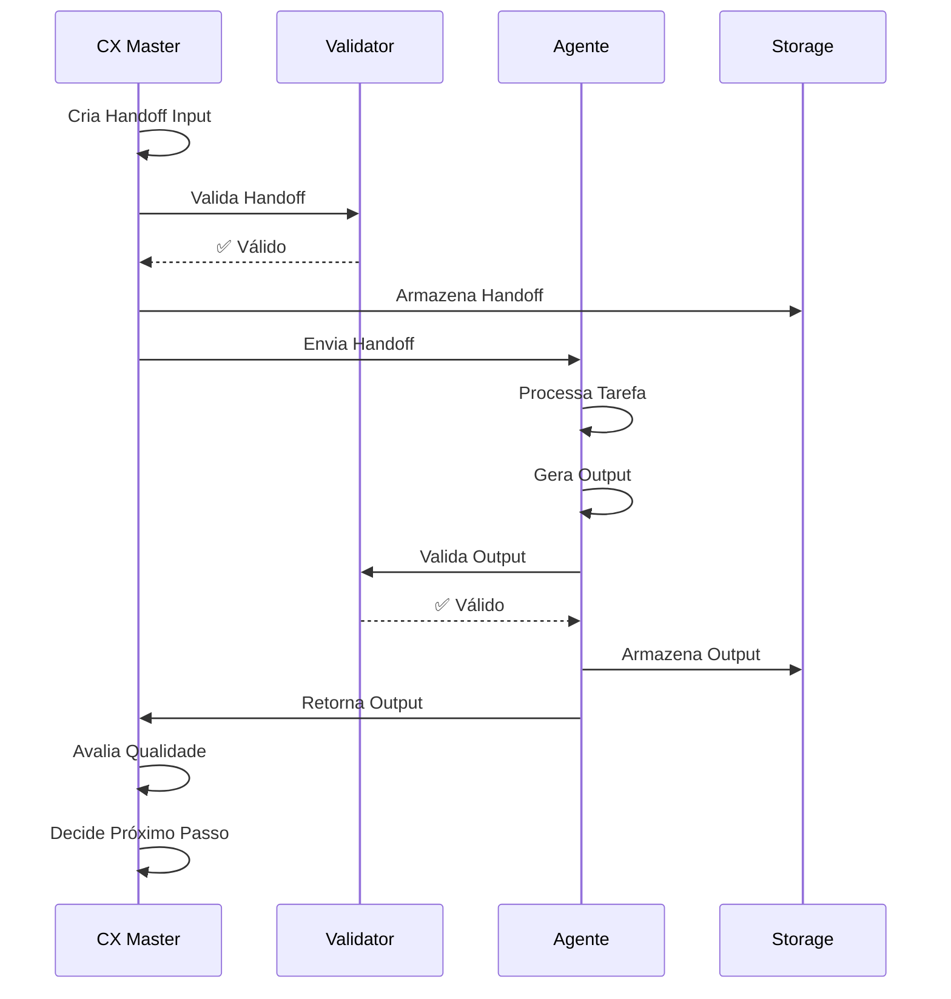

# 🔄 Protocolo de Comunicação e Handoff

## 📋 Visão Geral

Este documento define o protocolo de comunicação entre todos os agentes do sistema, garantindo transferência consistente de contexto e rastreabilidade completa.

## 🎯 Princípios do Protocolo

### 1. Formato Único
Todos os agentes usam o mesmo formato JSON para handoff, garantindo interoperabilidade.

### 2. Contexto Completo
Cada handoff carrega todo o contexto necessário para execução independente.

### 3. Rastreabilidade Total
Cada handoff possui ID único e timestamp para auditoria completa.

### 4. Validação Obrigatória
Todos os handoffs são validados antes de serem processados.

## 📦 Estrutura de Handoff

### Handoff Input (CX Master → Agente)

```json
{
  "handoff_id": "uuid-v4",
  "timestamp": "2026-04-16T17:00:00Z",
  "version": "1.0.0",
  
  "routing": {
    "from": "cx_master",
    "to": "fase_1_pesquisador",
    "fase_atual": "research",
    "fase_numero": 1,
    "total_fases": 5
  },
  
  "contexto_acumulado": {
    "projeto": {
      "id": "proj_uuid",
      "nome": "FitLife App",
      "tipo": "app_mobile",
      "cliente": "FitLife Startup",
      "data_inicio": "2026-04-01"
    },
    
    "briefing": {
      "resumo": "App mobile para acompanhamento de treinos",
      "objetivos_negocio": [
        "Facilitar registro de treinos",
        "Motivar usuários com gamificação",
        "Integrar com wearables"
      ],
      "publico_alvo": {
        "idade": "25-45 anos",
        "perfil": "Praticantes regulares de exercícios",
        "comportamento": "Tech-savvy, orientados a dados"
      }
    },
    
    "restricoes": {
      "tecnicas": [
        "React Native (iOS + Android)",
        "Backend: Node.js + PostgreSQL",
        "Integração: HealthKit/Google Fit"
      ],
      "negocio": [
        "Orçamento: R$ 150.000",
        "Prazo: 12 semanas",
        "MVP primeiro, features avançadas depois"
      ],
      "design": [
        "Acessibilidade WCAG 2.1 AA obrigatória",
        "Suporte a modo escuro",
        "Performance: < 3s para carregamento"
      ]
    },
    
    "fases_completadas": [
      {
        "fase": "fase_0_estrategista",
        "data_conclusao": "2026-04-05",
        "quality_score": 88,
        "output_path": "outputs/fase0/"
      }
    ],
    
    "decisoes_tomadas": [
      {
        "data": "2026-04-05",
        "decisao": "Priorizar iOS para MVP",
        "justificativa": "70% do público-alvo usa iOS",
        "impacto": "Android será fase 2"
      }
    ]
  },
  
  "inputs_disponiveis": {
    "artefatos": [
      {
        "tipo": "documento",
        "nome": "Contrato de Escopo",
        "path": "outputs/fase0/contrato-escopo.md",
        "formato": "markdown"
      },
      {
        "tipo": "documento",
        "nome": "Matriz de Maturidade",
        "path": "outputs/fase0/matriz-maturidade.md",
        "formato": "markdown"
      }
    ],
    
    "dados_brutos": {
      "analytics": {
        "usuarios_concorrentes": 50000,
        "nps_medio_mercado": 45,
        "taxa_retencao_media": 0.35
      },
      "pesquisa_mercado": {
        "tamanho_mercado": "R$ 2.5B",
        "crescimento_anual": "15%"
      }
    },
    
    "outputs_anteriores": {
      "fase_0": {
        "viabilidade": "aprovado",
        "score_maturidade": {
          "design": 2,
          "tecnica": 3,
          "ux": 2
        },
        "restricoes_mapeadas": 15,
        "riscos_identificados": 3
      }
    }
  },
  
  "output_esperado": {
    "tipo": "research_insights",
    "formato": "json+markdown",
    "entregaveis_obrigatorios": [
      "matriz_friccoes",
      "personas_validadas",
      "jornada_as_is",
      "insights_estrategicos"
    ],
    "entregaveis_opcionais": [
      "analise_competitiva_detalhada",
      "mapa_empatia"
    ],
    "criterios_sucesso": [
      "Pelo menos 3 personas criadas",
      "Mínimo 10 fricções identificadas",
      "Jornada mapeada com 5+ touchpoints",
      "Insights priorizados por impacto"
    ],
    "quality_threshold": 80,
    "formato_output": {
      "estrutura": "json",
      "documentacao": "markdown",
      "visualizacoes": "mermaid"
    }
  },
  
  "configuracao": {
    "prioridade": "alta",
    "deadline": "2026-04-12T23:59:59Z",
    "max_iteracoes": 3,
    "iteracao_atual": 1,
    "modo_execucao": "completo",
    "validacao_automatica": true
  },
  
  "metadata": {
    "criado_por": "cx_master",
    "criado_em": "2026-04-16T17:00:00Z",
    "versao_protocolo": "1.0.0",
    "ambiente": "production"
  }
}
```

### Handoff Output (Agente → CX Master)

```json
{
  "output_id": "uuid-v4",
  "handoff_id": "uuid-v4-do-input",
  "timestamp": "2026-04-16T18:30:00Z",
  "version": "1.0.0",
  
  "execucao": {
    "fase_completada": "fase_1_pesquisador",
    "agente_executor": "macro_pesquisador",
    "subagentes_utilizados": [
      "extrator_dores",
      "criador_personas",
      "validador_ideias"
    ],
    "tempo_execucao": "1h 30m",
    "data_inicio": "2026-04-16T17:00:00Z",
    "data_conclusao": "2026-04-16T18:30:00Z"
  },
  
  "qualidade": {
    "score_final": 87,
    "breakdown": {
      "completude": 90,
      "qualidade": 88,
      "consistencia": 85,
      "viabilidade": 86
    },
    "criterios_atendidos": 12,
    "criterios_totais": 14,
    "aprovacao_automatica": true
  },
  
  "entregaveis": [
    {
      "tipo": "matriz_friccoes",
      "nome": "Matriz de Fricções Reais",
      "path": "outputs/fase1/matriz-friccoes.md",
      "formato": "markdown",
      "tamanho": "15 fricções identificadas",
      "quality_score": 88,
      "metadata": {
        "criado_em": "2026-04-16T17:45:00Z",
        "validado": true
      }
    },
    {
      "tipo": "personas",
      "nome": "Personas Validadas",
      "path": "outputs/fase1/personas.json",
      "formato": "json",
      "tamanho": "3 personas criadas",
      "quality_score": 90,
      "metadata": {
        "criado_em": "2026-04-16T18:00:00Z",
        "validado": true
      }
    },
    {
      "tipo": "jornada",
      "nome": "Jornada As-Is",
      "path": "outputs/fase1/jornada-as-is.md",
      "formato": "markdown+mermaid",
      "tamanho": "7 touchpoints mapeados",
      "quality_score": 85,
      "metadata": {
        "criado_em": "2026-04-16T18:15:00Z",
        "validado": true
      }
    },
    {
      "tipo": "insights",
      "nome": "Insights Estratégicos",
      "path": "outputs/fase1/insights.json",
      "formato": "json",
      "tamanho": "12 insights priorizados",
      "quality_score": 86,
      "metadata": {
        "criado_em": "2026-04-16T18:25:00Z",
        "validado": true
      }
    }
  ],
  
  "issues": [
    {
      "id": "issue_001",
      "severidade": "media",
      "tipo": "dados_incompletos",
      "descricao": "Dados de NPS de concorrentes limitados",
      "impacto": "Análise competitiva menos precisa",
      "recomendacao": "Complementar com pesquisa adicional na Fase 2",
      "bloqueante": false,
      "afeta_fases": ["fase_2"]
    },
    {
      "id": "issue_002",
      "severidade": "baixa",
      "tipo": "documentacao",
      "descricao": "Mapa de empatia não foi criado",
      "impacto": "Entregável opcional não incluído",
      "recomendacao": "Pode ser criado posteriormente se necessário",
      "bloqueante": false,
      "afeta_fases": []
    }
  ],
  
  "insights_chave": [
    {
      "categoria": "comportamento",
      "insight": "Usuários abandonam apps de fitness após 3 semanas",
      "evidencia": "Análise de 5 concorrentes + 200 reviews",
      "impacto": "alto",
      "recomendacao": "Implementar sistema de gamificação e streaks"
    },
    {
      "categoria": "dor",
      "insight": "Registro manual de treinos é principal fricção",
      "evidencia": "Mencionado em 65% dos reviews negativos",
      "impacto": "critico",
      "recomendacao": "Priorizar auto-detecção de exercícios"
    }
  ],
  
  "recomendacoes": [
    "Priorizar features de retenção (gamificação, notificações)",
    "Investir em auto-detecção de exercícios para reduzir fricção",
    "Criar comunidade de usuários para aumentar engajamento",
    "Considerar integração com personal trainers na fase 2"
  ],
  
  "proximo_passo": {
    "acao": "prosseguir",
    "proxima_fase": "fase_2_arquiteto",
    "justificativa": "Score acima do threshold (87 > 80) e sem issues bloqueantes",
    "preparacao_necessaria": [
      "Revisar personas com stakeholders",
      "Validar priorização de fricções",
      "Confirmar insights estratégicos"
    ]
  },
  
  "metricas": {
    "tempo_total": "1h 30m",
    "tempo_por_subagente": {
      "extrator_dores": "35m",
      "criador_personas": "40m",
      "validador_ideias": "15m"
    },
    "tokens_utilizados": 45000,
    "custo_estimado": "$2.50",
    "iteracoes_internas": 2
  },
  
  "metadata": {
    "criado_por": "macro_pesquisador",
    "criado_em": "2026-04-16T18:30:00Z",
    "versao_protocolo": "1.0.0",
    "ambiente": "production",
    "llm_utilizado": "gpt-4",
    "temperatura": 0.7
  }
}
```

## ✅ Validação de Handoff

### Regras de Validação

```python
class HandoffValidator:
    REQUIRED_FIELDS_INPUT = [
        "handoff_id",
        "timestamp",
        "routing",
        "contexto_acumulado",
        "output_esperado"
    ]
    
    REQUIRED_FIELDS_OUTPUT = [
        "output_id",
        "handoff_id",
        "execucao",
        "qualidade",
        "entregaveis",
        "proximo_passo"
    ]
    
    def validate_input(self, handoff: dict) -> tuple[bool, list[str]]:
        """Valida handoff de entrada"""
        errors = []
        
        # Verifica campos obrigatórios
        for field in self.REQUIRED_FIELDS_INPUT:
            if field not in handoff:
                errors.append(f"Campo obrigatório ausente: {field}")
        
        # Valida UUID
        if not self._is_valid_uuid(handoff.get("handoff_id")):
            errors.append("handoff_id inválido")
        
        # Valida timestamp
        if not self._is_valid_timestamp(handoff.get("timestamp")):
            errors.append("timestamp inválido")
        
        # Valida contexto mínimo
        if not self._has_minimum_context(handoff.get("contexto_acumulado")):
            errors.append("Contexto insuficiente")
        
        return len(errors) == 0, errors
    
    def validate_output(self, output: dict) -> tuple[bool, list[str]]:
        """Valida handoff de saída"""
        errors = []
        
        # Verifica campos obrigatórios
        for field in self.REQUIRED_FIELDS_OUTPUT:
            if field not in output:
                errors.append(f"Campo obrigatório ausente: {field}")
        
        # Valida quality score
        score = output.get("qualidade", {}).get("score_final")
        if not (0 <= score <= 100):
            errors.append("Quality score deve estar entre 0 e 100")
        
        # Valida entregáveis
        if not output.get("entregaveis"):
            errors.append("Nenhum entregável fornecido")
        
        # Valida próximo passo
        valid_actions = ["prosseguir", "iterar", "aprovar", "escalar"]
        if output.get("proximo_passo", {}).get("acao") not in valid_actions:
            errors.append("Ação de próximo passo inválida")
        
        return len(errors) == 0, errors
```

## 🔄 Fluxo de Comunicação

### Sequência Completa



## 📊 Rastreabilidade

### Sistema de Logs

Cada handoff gera logs estruturados:

```json
{
  "log_id": "uuid",
  "timestamp": "ISO-8601",
  "tipo": "handoff_input|handoff_output",
  "handoff_id": "uuid",
  "fase": "nome_fase",
  "agente": "nome_agente",
  "acao": "criado|enviado|recebido|processado|validado",
  "status": "sucesso|erro|pendente",
  "detalhes": {},
  "erro": null
}
```

### Auditoria Completa

Permite rastrear:
- Quando cada handoff foi criado
- Quem criou e quem recebeu
- Quanto tempo levou para processar
- Quais validações foram executadas
- Quais erros ocorreram

---

**Documento Criado:** 2026-04-16  
**Versão:** 1.0.0  
**Status:** Protocolo Definido