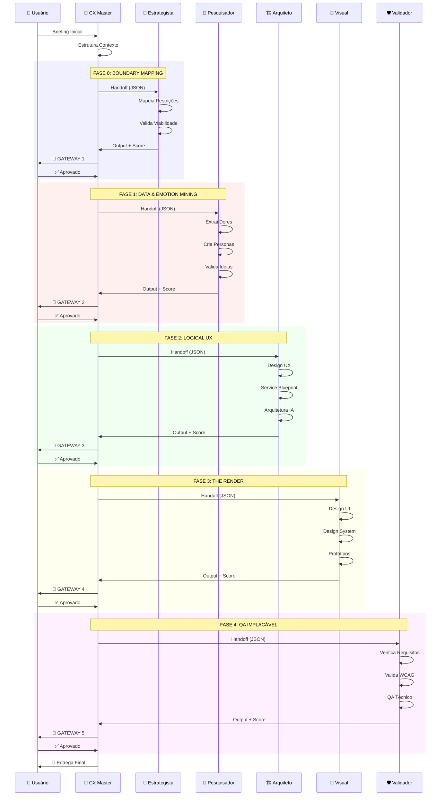
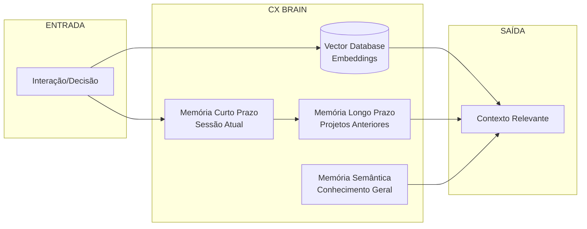
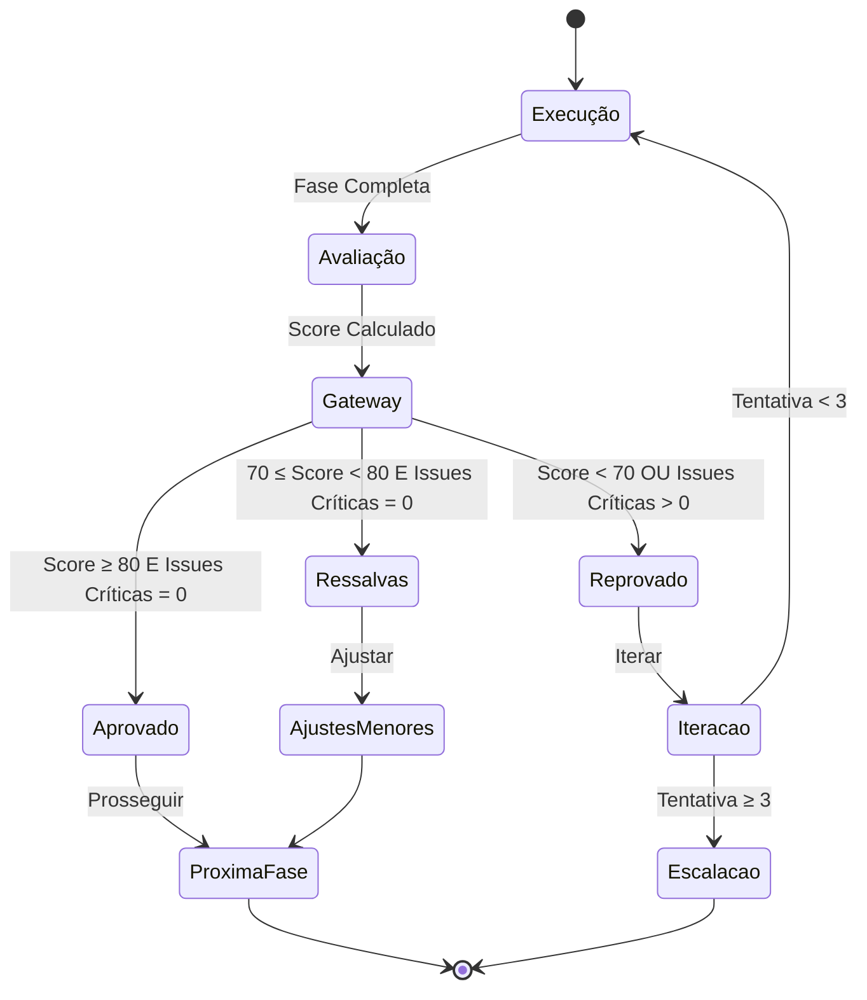
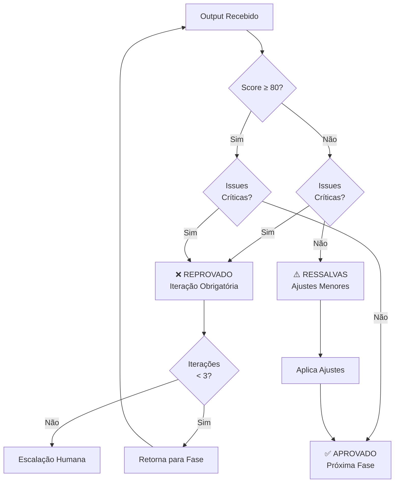
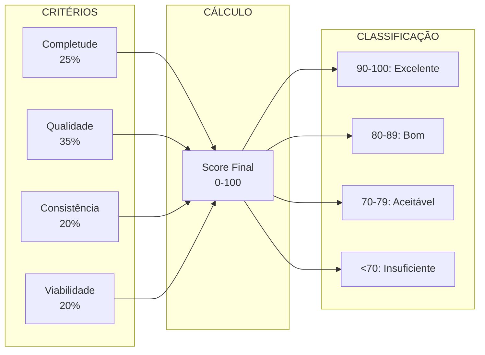
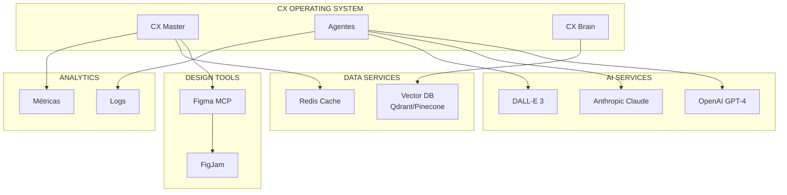
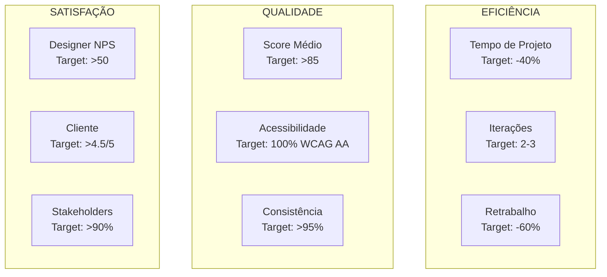
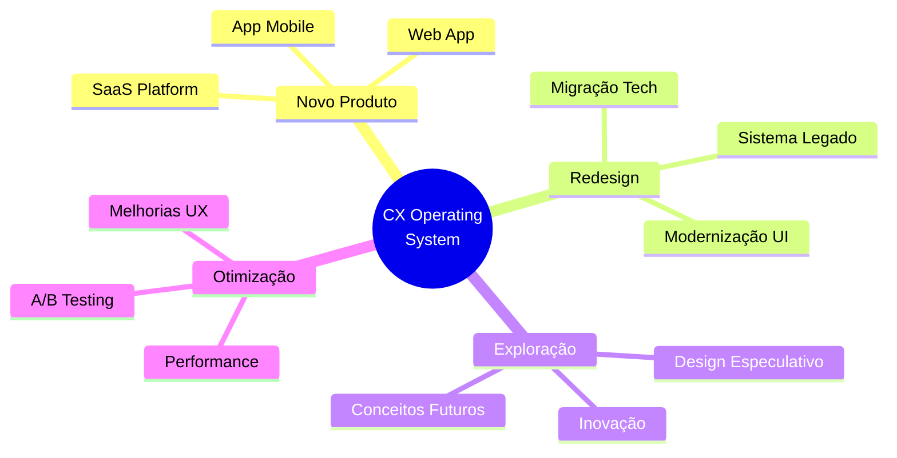

# 🏗️ Visão Geral do Sistema - CX Operating System

## 📊 Arquitetura Completa

### Diagrama de Arquitetura Hierárquica

```mermaid
graph TB
    subgraph "NÍVEL 1 - ORQUESTRAÇÃO"
        Master[👑 CX MASTER<br/>Orquestrador Central]
    end
    
    subgraph "NÍVEL 2 - COORDENAÇÃO"
        E[📌 ESTRATEGISTA<br/>Boundary Mapping]
        P[🔎 PESQUISADOR<br/>Data & Emotion Mining]
        A[🏗️ ARQUITETO<br/>Logical UX]
        V[🎨 VISUAL<br/>The Render]
        Val[🛡️ VALIDADOR<br/>QA Implacável]
    end
    
    subgraph "NÍVEL 3 - EXECUÇÃO"
        E1[Boundary Mapper]
        E2[Scope Validator]
        
        P1[Extrator de Dores]
        P2[Criador de Personas]
        P3[Validador de Ideias]
        
        A1[UX Designer]
        A2[Service Designer]
        A3[IA Architect]
        
        V1[UI Designer]
        V2[Design System Manager]
        V3[Prototyper]
        
        Val1[Verificador Requisitos]
        Val2[Validador Acessibilidade]
        Val3[QA Analyst]
    end
    
    subgraph "INFRAESTRUTURA"
        Brain[🧠 CX BRAIN<br/>Memória Global]
        EQ[❤️ MOTOR EQ<br/>Inteligência Emocional]
        Figma[🎨 FIGMA MCP<br/>Integração Design]
    end
    
    Master --> E
    Master --> P
    Master --> A
    Master --> V
    Master --> Val
    
    E --> E1
    E --> E2
    
    P --> P1
    P --> P2
    P --> P3
    
    A --> A1
    A --> A2
    A --> A3
    
    V --> V1
    V --> V2
    V --> V3
    
    Val --> Val1
    Val --> Val2
    Val --> Val3
    
    Master -.usa.-> Brain
    Master -.usa.-> EQ
    V -.usa.-> Figma
    P -.usa.-> EQ
```

## 🔄 Fluxo de Execução Completo

### Sequência de Fases com Gateways

## 🧠 Sistema de Memória (CX Brain)

### Arquitetura de Memória

### Tipos de Memória

| Tipo | Duração | Conteúdo | Uso |
|------|---------|----------|-----|
| **Curto Prazo** | Sessão atual | Interações recentes, contexto ativo | Decisões imediatas |
| **Longo Prazo** | Permanente | Projetos anteriores, padrões aprendidos | Aprendizado contínuo |
| **Semântica** | Permanente | Princípios de design, melhores práticas | Conhecimento base |

## 🛑 Sistema de Gateways

### Fluxo de Aprovação

### Critérios de Decisão

## 📊 Sistema de Qualidade

### Cálculo de Score

### Matriz de Severidade

| Severidade | Impacto | Bloqueante | Ação |
|------------|---------|------------|------|
| 🔴 **Crítico** | Impede uso ou viola lei | ✅ Sim | Iteração obrigatória |
| 🟠 **Alto** | Impacta experiência significativamente | ❌ Não | Correção recomendada |
| 🟡 **Médio** | Melhoria desejável | ❌ Não | Considerar correção |
| 🟢 **Baixo** | Nice-to-have | ❌ Não | Opcional |

## 🔌 Integrações Externas

### Mapa de Integrações

## 📈 Métricas e KPIs

### Dashboard de Métricas

## 🎯 Casos de Uso

### Tipos de Projeto

---

**Documento Criado:** 2026-04-16  
**Versão:** 1.0.0  
**Status:** Arquitetura Consolidada